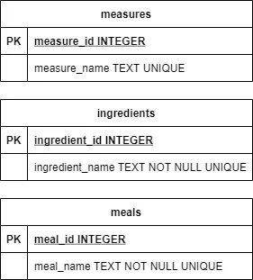

# Stage 1/5: Create dictionaries
## Description
Your great-grandmother asked you to copy "to these computers" all the recipes that she had been collecting in her  
notebook for several decades. You think that this task can be a good opportunity to practice your skills and  
build a tool that would collect the data in a database. It will allow you to create a database of recipes that  
you will be able to use in the blog with the great-grandma's recipes. You started by writing down the names of the  
ingredients and measures that Grandma used. It also may be good to assign different dishes to different times of the day.  
It's time to create a database and dictionaries!

Below is a diagram of the database tables. **PK** means the **Primary Key**.



## Theory
SQLite3 is a relational database management system. You can use it for free; it is licensed as Public Domain.  
The system implements most of the SQL standards.  
For this project, we will use the basic SQLite3 functions.

First, import the sqlite3 library:
```markdown
import sqlite3
```
To connect your script to an SQLite database, use the `connect()` method from the `sqlite3` library and  
create a database cursor with the `cursor()` method:
```markdown
conn = sqlite3.connect(data_base_name)
cursor_name = conn.cursor()
```
To execute an SQL query, use the `execute()` cursor method. This method will return an object that contains  
the result of the query.  
For example:
```markdown
result = cursor_name.execute(SQL_query_as_string)
```
Another two important methods are `close()` and `commit()`. Remember that you need to confirm the SQL queries with  
the `commit` command. Otherwise, the data will be lost. At the end of your code, disconnect your database.  
Both methods are related to the database connection:
```markdown
conn.commit()
conn.close()
```
If you need more information, the [SQLite Tutorial](https://www.sqlitetutorial.net/) will help you!

## Objectives
1. Create a database. Pass the name of the database to the script as an argument.
2. Create a _table_ named `meals` with two columns:  
   `meal_id` of an integer type with the primary key attribute,  
   `meal_name` of a text type and with the unique and not null attribute.
3. Create a _table_ named `ingredients` with two columns:  
   `ingredient_id` of an integer type with the primary key attribute  
   `ingredient_name` of a text type with the unique and not null attribute.  
   Multi-word ingredients are out of scope, you don't need to implement their support in your script.
4. Create a _table_ named `measures` with two columns:  
   `measure_id` of an integer type with the primary key attribute,  
   `measure_name` of a text type with the unique attribute.
5. Populate the tables. Those tables are the dictionaries for the Food Blog system, you need to fill them once for the rest of the stages.
    ```markdown
    data = {"meals": ("breakfast", "brunch", "lunch", "supper"),
            "ingredients": ("milk", "cacao", "strawberry", "blueberry", "blackberry", "sugar"),
            "measures": ("ml", "g", "l", "cup", "tbsp", "tsp", "dsp", "")}
    ```
6. Tests do not check the output. You can print anything you want. Tests will check only the database file that your script will create.
7. Do not add other items to the dictionaries. This may affect the test results in this and the next stages.

**Tip**: If you would like to see how your database looks like, you can use the **DB Browser for SQLite** tool.  
It can be downloaded from [sqlitebrowser.org](https://sqlitebrowser.org/) for free.

## Example
The greater-than symbol followed by a space (> ) represents the user input. Note that it's not part of the input.
```markdown
> python food_blog.py food_blog.db
```