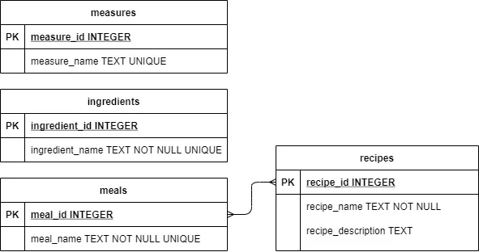
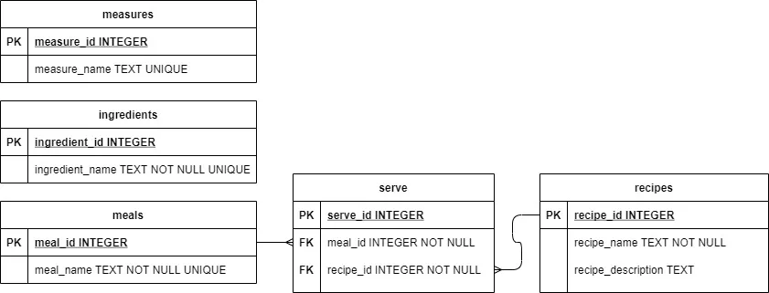

# Stage 3/5: Many-to-many relations
## Description

On this stage, you need to create many-to-many relations between two tables. One dish can be served at different  
mealtimes, and one meal can consist of different dishes.

Below is a database diagram showing tables with a **many-to-many relationship**.



However, this model is not recommended. Instead, we suggest you implementing a cross-reference table that  
contains primary key attributes from the two tables in relation.

Take a look at the diagram below. It contains an intermediate table; one-to-many relationships are also indicated.  
**FK** stands for **Foreign Key**.



You need to expand your backend system.

## Theory
In SQLite, you can use two methods to retrieve entries from the returned object: `fetchall()` and `fetchone()`.  
The first method returns all matching entries as a list of tuples, while the second method returns the next  
data row or `None` if there are no more rows:
```markdown
result = cursor_name.execute(SQL_query_as_string)
all_rows = result.fetchall()  # all_rows stores a list of tuples

result = cursor_name.execute(SQL_query_as_string)
next_row = result.fetchone()  # returns a single tuple
```
A useful attribute of the cursor object is `lastrowid`. When the `INTEGER PRIMARY KEY` column is auto-incremented,  
this attribute stores the value of this key. It allows you to know the `PRIMARY KEY` attribute of the entry.  
Don't forget to commit your changes!
```markdown
result = cursor_name.execute(SQL_INSERT_query_as_string).lastrowid
```
To use foreign keys in your SQLite database, you need to turn them on first by executing the command:
```markdown
PRAGMA foreign_keys = ON;
```
When creating a table, you need to associate the foreign key with the given column:
```markdown
CREATE TABLE IF NOT EXISTS table1(table1_id INTEGER PRIMARY KEY, table2_id INTEGER NOT NULL,
FOREIGN KEY(table2_id) REFERENCES table2(table2_id));
```
Once you indicated the `FOREIGN KEY` parameter in your code, the entries associated with this parameter cannot be  
deleted as long as this parameter persists. In the example above, we won't be able to remove the entries from  
the `table2` until we remove the linking entry from the `table1`.

You can refer to the [Foreign Key](https://www.sqlitetutorial.net/sqlite-foreign-key/) section of the SQLite tutorial for more details.

## Objectives
1. Create a table named `serve` with three columns: `serve_id` of an `INTEGER` type with the `PRIMARY KEY` attribute,  
   and `recipe_id` and `meal_id`, both of `INTEGER` type with the `NOT NULL` attribute.
2. Assign the `recipe_id` and `meal_id` as `Foreign Keys` to the following tables: `recipes` (the `recipe_id` column)  
   and `meals` (the `meal_id` column).
3. Once a user has entered a dish name and a recipe description print all available meals with their primary key numbers.
4. Ask a user when this dish can be served. Users should input numbers separated by a space.
5. Input values to the `serve` table. If the user has selected three meals when the dish can be served, there  
   should be three new entries in the `serve` table.
6. You do not need to validate the entered data. The tests will enter the correct values.
7. Tests do not check the output. You can print anything you want. Tests will check only the database file that  
   your script will create.

## Examples
The greater-than symbol followed by a space (> ) represents the user input. Note that it's not part of the input.
```markdown
> python food_blog.py food_blog.db
Pass the empty recipe name to exit.
Recipe name: > Hot milk
Recipe description: > Boil milk
1) breakfast  2) brunch  3) lunch  4) supper 
When the dish can be served: > 1 3 4
Recipe name:
```
## Solution
```python
import sqlite3

DB_NAME = "food_blog.db"
# DB_NAME = "C:/Users/tomas/PycharmProjects/Food Blog Backend/Food.db"

data = {"meals": ("breakfast", "brunch", "lunch", "supper"),
        "ingredients": ("milk", "cacao", "strawberry", "blueberry", "blackberry", "sugar"),
        "measures": ("ml", "g", "l", "cup", "tbsp", "tsp", "dsp", "")}

def create_stage1(conn, data):
    conn.execute("""
        CREATE TABLE IF NOT EXISTS meals(
            meal_id INTEGER PRIMARY KEY,
            meal_name TEXT UNIQUE NOT NULL
        );
    """)

    conn.execute("""
        CREATE TABLE IF NOT EXISTS ingredients(
            ingredient_id INTEGER PRIMARY KEY,
            ingredient_name TEXT UNIQUE NOT NULL
        );
    """)

    conn.execute("""
        CREATE TABLE IF NOT EXISTS measures(
            measure_id INTEGER PRIMARY KEY,
            measure_name TEXT UNIQUE
        );
    """)

    # Check if meals table already has data
    cur = conn.cursor()
    cur.execute("SELECT COUNT(*) FROM meals;")
    if cur.fetchone()[0] == 0:
        # Only insert if empty
        for table, values in data.items():
            column = table[:-1] + "_name"
            conn.executemany(
                f"INSERT INTO {table} ({column}) VALUES (?);",
                [(v,) for v in values]
            )
        conn.commit()


def create_stage2(conn):
    conn.execute("""
                CREATE TABLE IF NOT EXISTS recipes
                (
                    recipe_id          INTEGER PRIMARY KEY,
                    recipe_name        TEXT NOT NULL,
                    recipe_description TEXT
                );
                """)
    conn.commit()


def create_stage3(conn):
    conn.execute("""
                 CREATE TABLE IF NOT EXISTS serve
                 (
                     serve_id  INTEGER PRIMARY KEY,
                     recipe_id INTEGER NOT NULL,
                     meal_id   INTEGER NOT NULL,
                     FOREIGN KEY (recipe_id) REFERENCES recipes (recipe_id),
                     FOREIGN KEY (meal_id) REFERENCES meals (meal_id)
                 );
                 """)
    conn.commit()


def add_recipe(conn, name, description, serving):
    cur = conn.cursor()

    # Insert recipe
    cur.execute("""
        INSERT INTO recipes (recipe_name, recipe_description)
        VALUES (?, ?);
    """, (name, description))

    recipe_id = cur.lastrowid  # get the new recipe's ID

    # Insert into serve table
    meal_ids = serving.split()  # e.g. "1 3 4" → ["1", "3", "4"]

    for meal_id in meal_ids:
        cur.execute("""
            INSERT INTO serve (recipe_id, meal_id)
            VALUES (?, ?);
        """, (recipe_id, int(meal_id)))

    conn.commit()


def prompt_for_recipe():
    recipe_name = input("Recipe name: ").strip()
    if recipe_name == "":
        return None  # signal to stop

    recipe_description = input("Recipe description: ").strip()
    recipe_serving = input(
        "1) breakfast  2) brunch  3) lunch  4) supper \n"
        "When the dish can be served: "
    ).strip()

    return recipe_name, recipe_description, recipe_serving


def main():
    with sqlite3.connect(DB_NAME) as conn:
        cur = conn.cursor()
        cur.execute("PRAGMA foreign_keys = ON;")

        create_stage1(conn, data)
        create_stage2(conn)
        create_stage3(conn)

        print("Pass the empty recipe name to exit.")

        while True:
            result = prompt_for_recipe()
            if result is None:
                break

            name, description, serving = result
            add_recipe(conn, name, description, serving)

    conn.close()


if __name__ == "__main__":
    main()
```