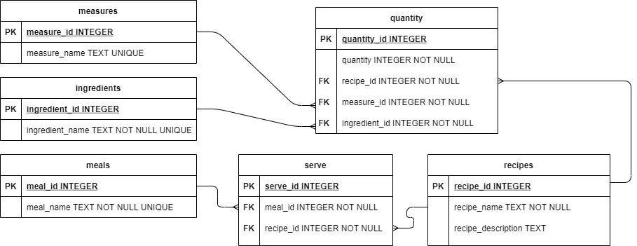

# Stage 4/5: Too many ingredients!
## Description
It's time to add ingredient quantities, measures, and ingredient names to your recipes! You noticed that some  
ingredients have long names and measures rarely start with the same letter. You decided to build your backend so  
that you do not have to enter full names when completing the database. You will encounter a many-to-many relationship 
again, this time between three tables, so you decided to introduce an intermediate table that would link all three tables.

Below is a diagram of the database tables.



Objectives
1. Create a table named `quantity` with five columns: `quantity_id` of an `INTEGER` type with the `PRIMARY KEY` attribute,  
   and four other columns: `measure_id`, `ingredient_id`, `quantity` and `recipe_id` . They should be of an `INTEGER `type  
   with the `NOT NULL` attribute.
2. Assign the following columns `measure_id`, `ingredient_id` and `recipe_id` as `Foreign Keys` to the following  
   tables (columns): `measures (measure_id)`, `ingredients (ingredient_id)`, and `recipes (recipe_id)`
3. After asking a user about certain mealtime, make a loop that will gather information about the ingredients.  
   The ingredients should be entered in the following format: `quantity measure ingredient`.
4. Pressing `<Enter>` should finish the information gathering.
5. The measure parameter should start with a string provided by a user. If there is more than one measure that  
   starts with the provided string, ask the user again. For example `tbs` and `tbsp` both start with the `t`.  
   So the `1 t sugar` entry **should not pass**.
6. Mind that the `measures` table contains an entry where the `measure_name` is empty string, it means, that the measure  
   could be not provided. In this case, use this entry to relate tables. For example, `1 strawberry` should have  
   a `measure_key` from the entry with an empty name.
7. The ingredient parameter should contain strings provided by a user. If there is more than one ingredient that  
   contains the provided string, ask the user again. For example `strawberry` and `blueberry` both contain berry as  
   part of the string. So the` 10 kg berry` entry should not pass.
8. Tests do not check the output. You can print anything you want. Tests will check only the database file  
   that your script will create.

## Examples
The greater-than symbol followed by a space (> ) represents the user input. Note that it's not part of the input.
### Example 1:
```markdown
> python food_blog.py food_blog.db
Pass the empty recipe name to exit.
Recipe name: Hot milk
Recipe description: Boil milk
1) breakfast  2) brunch  3) lunch  4) supper 
Enter proposed meals separated by a space: 1 3 4
Input quantity of ingredient <press enter to stop>: 10 ml milk
Input quantity of ingredient <press enter to stop>: 
Recipe name:
```
### Example 2:
```markdown
> python food_blog.py food_blog.db
Pass the empty recipe name to exit.
Recipe name: Hot milk
Recipe description: Boil milk
1) breakfast  2) brunch  3) lunch  4) supper 
Enter proposed meals separated by a space: 1 3 4
Input quantity of ingredient <press enter to stop>: 250 ml m
Input quantity of ingredient <press enter to stop>: 1 t sugar
The measure is not conclusive!
Input quantity of ingredient <press enter to stop>: 1 tbs sugar
Input quantity of ingredient <press enter to stop>: 1 berry
The ingredient is not conclusive!
Input quantity of ingredient <press enter to stop>: 1 blueberry
Input quantity of ingredient <press enter to stop>: 
Recipe name:
```

## Solution:
```python
import sqlite3

DB_NAME = "food_blog.db"
# DB_NAME = "C:/Users/tomas/PycharmProjects/Food Blog Backend/Food.db"

data = {"meals": ("breakfast", "brunch", "lunch", "supper"),
        "ingredients": ("milk", "cacao", "strawberry", "blueberry", "blackberry", "sugar"),
        "measures": ("ml", "g", "l", "cup", "tbsp", "tsp", "dsp", "")}

def create_stage1(conn, data):
    conn.execute("""
        CREATE TABLE IF NOT EXISTS meals(
            meal_id INTEGER PRIMARY KEY,
            meal_name TEXT UNIQUE NOT NULL
        );
    """)

    conn.execute("""
        CREATE TABLE IF NOT EXISTS ingredients(
            ingredient_id INTEGER PRIMARY KEY,
            ingredient_name TEXT UNIQUE NOT NULL
        );
    """)

    conn.execute("""
        CREATE TABLE IF NOT EXISTS measures(
            measure_id INTEGER PRIMARY KEY,
            measure_name TEXT UNIQUE
        );
    """)

    # Check if meals table already has data
    cur = conn.cursor()
    cur.execute("SELECT COUNT(*) FROM meals;")
    if cur.fetchone()[0] == 0:
        # Only insert if empty
        for table, values in data.items():
            column = table[:-1] + "_name"
            conn.executemany(
                f"INSERT INTO {table} ({column}) VALUES (?);",
                [(v,) for v in values]
            )
        conn.commit()


def create_stage2(conn):
    conn.execute("""
                CREATE TABLE IF NOT EXISTS recipes
                (
                    recipe_id          INTEGER PRIMARY KEY,
                    recipe_name        TEXT NOT NULL,
                    recipe_description TEXT
                );
                """)
    conn.commit()


def create_stage3(conn):
    conn.execute("""
                 CREATE TABLE IF NOT EXISTS serve
                 (
                     serve_id  INTEGER PRIMARY KEY,
                     recipe_id INTEGER NOT NULL,
                     meal_id   INTEGER NOT NULL,
                     FOREIGN KEY (recipe_id) REFERENCES recipes (recipe_id),
                     FOREIGN KEY (meal_id) REFERENCES meals (meal_id)
                 );
                 """)
    conn.commit()


def create_stage4(conn):
    conn.execute("""
                 CREATE TABLE IF NOT EXISTS quantity
                 (
                     quantity_id   INTEGER PRIMARY KEY,
                     quantity      INTEGER NOT NULL,
                     recipe_id     INTEGER NOT NULL,
                     measure_id    INTEGER NOT NULL,
                     ingredient_id INTEGER NOT NULL,
                     FOREIGN KEY (recipe_id) REFERENCES recipes (recipe_id),
                     FOREIGN KEY (measure_id) REFERENCES measures (measure_id),
                     FOREIGN KEY (ingredient_id) REFERENCES ingredients (ingredient_id)
                 );
                 """)
    conn.commit()


def add_recipe(conn, name, description, serving, ingredients):
    cur = conn.cursor()

    # Insert recipe
    cur.execute("""
        INSERT INTO recipes (recipe_name, recipe_description)
        VALUES (?, ?);
    """, (name, description))
    recipe_id = cur.lastrowid

    # Insert into serve table
    for meal_id in serving.split():
        cur.execute("""
            INSERT INTO serve (recipe_id, meal_id)
            VALUES (?, ?);
        """, (recipe_id, int(meal_id)))

    # --- insert into quantity ---
    for part in ingredients:
        cur.execute("""
                    INSERT INTO quantity (quantity, recipe_id, measure_id, ingredient_id)
                    VALUES (?, ?, ?, ?);
                    """, (part[0], recipe_id, part[1], part[2]))

    conn.commit()


def prompt_for_recipe(conn):
    cur = conn.cursor()

    recipe_name = input("Recipe name: ").strip()
    if recipe_name == "":
        return None  # signal to stop

    recipe_description = input("Recipe description: ").strip()
    recipe_serving = input(
        "1) breakfast  2) brunch  3) lunch  4) supper \n"
        "Enter proposed meals separated by a space: "
    ).strip()

    material = []
    # Ingredient loop "quantity measure ingredient"
    while True:
        line = input("Input quantity of ingredient <press enter to stop>: ").strip()
        if line == "":
            break

        parts = line.split()
        quantity = int(parts[0])

        if len(parts) == 2:
            measure = ""
            ingredient = parts[1]
        else:
            measure = parts[1]
            ingredient = " ".join(parts[2:]) # if ingredient consists of more words
            # ingredient = parts[2] # test project provides only single word ingredients

        # --- match measure ---
        cur.execute("""
                    SELECT measure_id, measure_name
                    FROM measures
                    WHERE measure_name LIKE ?;
                    """, (measure + "%",))
        measures = cur.fetchall()

        if len(measures) != 1:
            print("The measure is not conclusive!")
            continue

        measure_id = measures[0][0]

        # --- match ingredient ---
        cur.execute("""
                    SELECT ingredient_id, ingredient_name
                    FROM ingredients
                    WHERE ingredient_name LIKE ?;
                    """, ("%" + ingredient + "%",))
        ingredients = cur.fetchall()

        if len(ingredients) != 1:
            print("The ingredient is not conclusive!")
            continue

        ingredient_id = ingredients[0][0]

        material.append((quantity,measure_id,ingredient_id))

    return recipe_name, recipe_description, recipe_serving, material


def main():
    with sqlite3.connect(DB_NAME) as conn:
        cur = conn.cursor()
        cur.execute("PRAGMA foreign_keys = ON;")

        create_stage1(conn, data)
        create_stage2(conn)
        create_stage3(conn)
        create_stage4(conn)

        print("Pass the empty recipe name to exit.")

        while True:
            result = prompt_for_recipe(conn)
            if result is None:
                break

            name, description, serving, ingredients = result
            add_recipe(conn, name, description, serving, ingredients)

    conn.close()


if __name__ == "__main__":
    main()
```